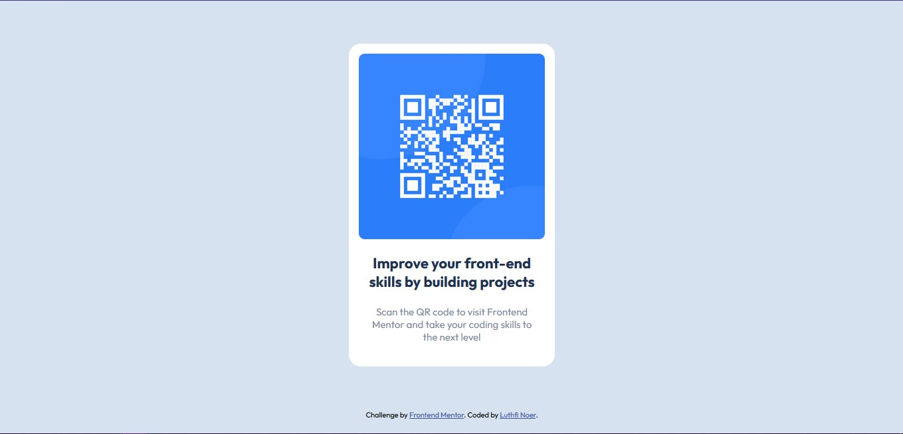

# Frontend Mentor - QR code component solution

This is a solution to the [QR code component challenge on Frontend Mentor](https://www.frontendmentor.io/challenges/qr-code-component-iux_sIO_H).

## Table of contents

- [Overview](#overview)
  - [Screenshot](#screenshot)
  - [Links](#links)
- [My process](#my-process)
  - [Built with](#built-with)
  - [What I learned](#what-i-learned)
- [Author](#author)

## Overview

### Screenshot

### Links

- Solution URL: [Add solution URL here](https://github.com/LuthfiDbz/QR-Code-Component-Main)
- Live Site URL: [Add live site URL here](https://qrcodecomponent-luthfinr.netlify.app/)

## My process

### Built with

- CSS custom properties
- Google Font

### What I learned

- Learn about using google fonts
- Learn about property margin with auto value

## Author

- Website - [Luthfi Noer](https://luthfinr.netlify.app/)
- Frontend Mentor - [@LuthfiDbz](https://www.frontendmentor.io/profile/LuthfiDbz)
- Twitter - [@luthfinr_dev](https://twitter.com/luthfinr_dev)
